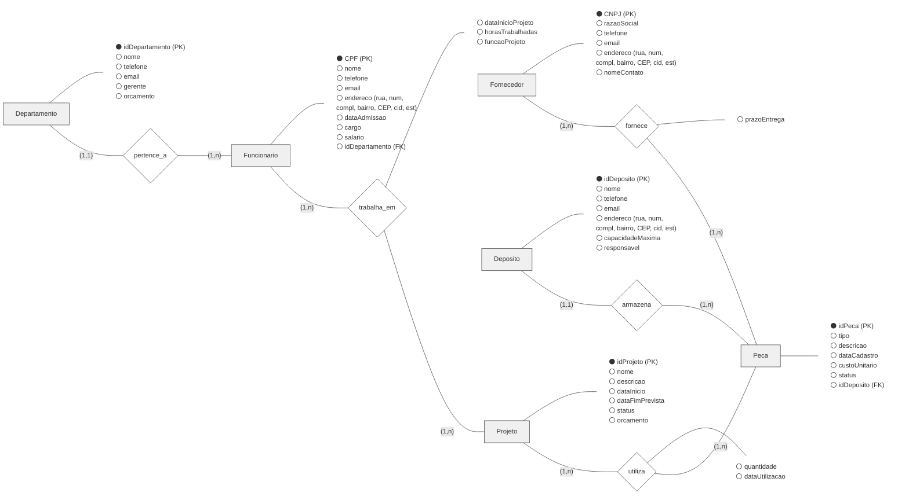

<h1 align="center">BANCO DE DADOS RELACIONAL</h1>

<p align="center">
  
</p>

#
## Sobre 

Repositório do trabalho semestral da disciplina <strong>Banco de Dados Relacional (BDR)</strong> — UNINTER, 2026. Projeto com foco em <strong>Modelagem (MER)</strong> e <strong>Implementação SQL</strong> em <strong>MySQL</strong>, dividido em:

- Modelagem conceitual (**MER**) com base em regras de negócio
- Implementação de um banco de dados (**MySQL**) a partir de um modelo relacional (lógico)
- Consultas SQL solicitadas e validações com dados fictícios
- Relatório final com códigos e evidências (prints)

---

## Requisitos de avaliação

Os critérios de avaliação incluem:

- Raciocínio aplicado na solução
- Clareza e objetividade nas implementações
- Originalidade
- Coerência com a notação/sintaxe vista em aula
- Uso correto de **SQL**
- Implementação manual (sem geração automática de código)
- Testes executados antes do envio (validar funcionamento)

---

## Etapas do trabalho

### Etapa de modelagem (MER)

Construção do **Modelo Entidade-Relacionamento (MER)** para um sistema corporativo de uma indústria, contemplando:

- Entidades e atributos
- Relacionamentos e cardinalidades
- Chaves primárias e estrangeiras
- Entidades associativas conforme o padrão definido no material da disciplina

**Caso de Uso:**

Uma indústria deseja implementar um Sistema de Informação Corporativo para gerenciar seus projetos, funcionários, departamentos, peças, depósitos das peças e fornecedores. Cada funcionário está vinculado a um único departamento e pode participar de vários projetos, registrando-se a data de início e as horas trabalhadas. Os projetos utilizam diferentes peças, de diferentes fornecedores, sendo necessário controlar quais materiais são utilizados, em que quantidade e qual fornecedor os forneceu. Para isso, a indústria contratou um profissional de Banco de Dados, a fim de modelar o Banco de Dados que armazenará todos os dados.

**Regras de Negócio:**

-	Projeto – Deverão ser armazenados os seguintes dados: identificação do projeto, nome, descrição, data de início, data de fim prevista, status (em andamento, concluído ou cancelado) e orçamento;
-	Funcionário – Deverão ser armazenados os seguintes dados: CPF, nome, telefone, e-mail, endereço – composto por rua, número, complemento, bairro, CEP, cidade e estado –, data de admissão, cargo e salário;
-	Departamento – Deverão ser armazenados os seguintes dados: identificação do departamento, nome, telefone, e-mail, gerente e orçamento;
-	Peça – Deverão ser armazenados os seguintes dados: identificação da peça, tipo de peça, descrição, data de cadastro, custo unitário e status (ativa ou inativa);
-	Depósito – Deverão ser armazenados os seguintes dados: identificação do deposito, nome, telefone, e-mail, endereço – composto por rua, número, complemento, bairro, CEP, cidade e estado –, capacidade máxima e responsável;
-	Fornecedor – Deverão ser armazenados os seguintes dados: CNPJ, razão social, telefone, e-mail, endereço – composto por rua, número, complemento, bairro, CEP, cidade e estado – e nome do contato;
-	Da relação entre funcionário e projeto deverão ser armazenados os seguintes dados: data de início no projeto, horas trabalhadas e função no projeto;
-	Da relação entre projeto e peça deverão ser armazenados os seguintes dados: quantidade e data de utilização;
-	Da relação entre fornecedor e peça deverá ser armazenado o seguinte dado: prazo de entrega;
-	Um ou vários funcionários pertencem a um departamento;
-	Um ou vários funcionários trabalham em um ou vários projetos;
-	Um ou vários projetos utilizam uma ou várias peças;
-	Um ou vários fornecedores fornecem uma ou várias peças;
-	Um depósito contém uma ou várias peças.

**Entregável desta etapa:**




---

### Etapa de implementação (MySQL)

Implementação do banco **Empresa** no **MySQL Workbench**, com:

- Criação das tabelas conforme o modelo relacional fornecido
- Restrição **NOT NULL** em todos os campos, exceto `idFinalizacao` em `OrdemServico`
- Execução de consultas SQL obrigatórias
- Testes utilizando o script de popularização fornecido pela disciplina

**Caso de Uso:**

Uma empresa deseja informatizar o controle de suas ordens de serviço, registrando os atendimentos realizados a seus clientes. Cada ordem de serviço é aberta para um cliente específico, sendo executada por um técnico e pode envolver um ou mais serviços. Para cada ordem, são armazenadas informações como data, equipamento e problema identificado. Ao final do atendimento, a ordem de serviço possui um registro de finalização, contendo a data de conclusão, a data de entrega ao cliente e o valor total. O sistema deve permitir o gerenciamento integrado de clientes, técnicos, serviços prestados e ordens de serviço.

**MER:**

<p align="center">
  
</p>

**Entregáveis desta etapa:**

- [Script de criação do banco e tabelas]()
- [Script de população de dados]()
- [Script consultas]()

---

## Tecnologia

&nbsp;

---

## Contribuição

```bash
git clone https://github.com/kaiquesouzasantoss/uninter-bdr-company.git
```
